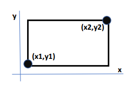

Crea un programa con una clase llamada Rectángulo que
representará un rectángulo mediante dos coordenadas (x1,y1) y
(x2,y2) en un plano, por lo que la clase deberá tener cuatro
atributos enteros: x1, y1, x2, y2.

En nuestro software necesitamos asegurarnos de que la coordenada
(x1, y1)
represente la esquina inferior izquierda y la (x2, y2) la
superior derecha del
rectángulo, como en el dibujo.
Añade a Rectángulo un constructor con los 4 parámetros. Incluye
un if que compruebe los valores (*). Si son válidos guardará los
parámetros en el objeto. Si no lo son, mostrará un mensaje del
estilo “ERROR al instanciar Rectangulo...” utilizando
System.err.println(…). No podremos evitar que se instancie el
objeto, pero al menos avisaremos por pantalla.
(*) Pista: Es suficiente con un if ((condición) && (condición))
Aplica el encapsulamiento básico a la clase Rectángulo: Declara
todos sus atributos como private y crea todos los getters y
setters necesarios (un get y un set por atributo). ¿Recuerdas la
condición explicada en segundo párrafo? Tendrás que programar
los setters de modo que comprueben el valor pasado como
argumento antes de guardarlo en el objeto. Si no fuera correcto
se mostrará un mensaje de error (y NO se guardará el valor).
Añade a la clase Rectángulo métodos públicos con las siguientes
funcionalidades:
• Método para imprimir la información del rectángulo por
pantalla.
• Métodos setters dobles y cuádruples: setX1Y1, set X2Y2 y
setAll(…).
x
(x1,y1)
(x2,y2)
y
• Métodos getPerimetro y getArea que calculen y devuelvan el
perímetro y área del objeto.
Necesitamos hacer algunos cambios para que todas las coordenadas
estén entre (0,0) y (100,100). Añade a la clase Rectángulo dos
atributos llamados min y max. Estos valores son comunes a todos
los objetos y no pueden variar. Piensa qué modificados necesitas
añadir a min y max. Utiliza min y max en el constructor y en los
setters para comprobar los valores (como de costumbre, si no son
correctos muestra un mensaje de error y apliques los cambios).
También necesitamos un método no constructor para crear
rectángulos aleatorios. Impleméntalo